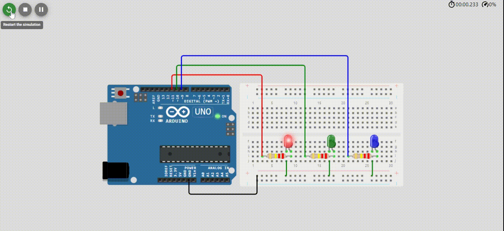
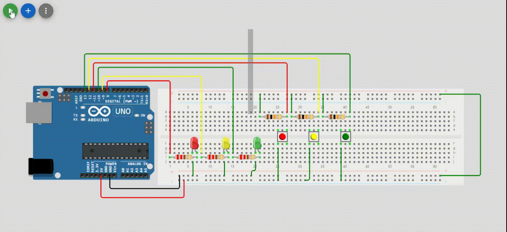
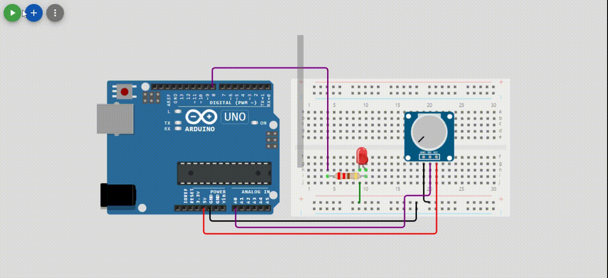
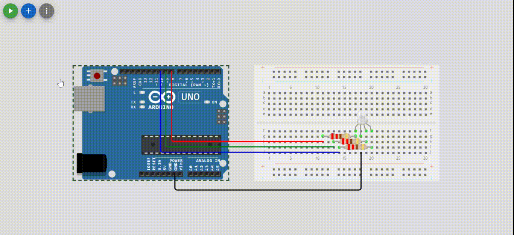

# tugas1-sistem-mikrokontroller
Repo ini digunakan untuk mengerjakan tugas 1 dari matakuliah sistem mikrokontroller

## Tugas Proyek LED - 3.1 LED Berkedip Bergantian

## Tugas Proyek LED - 3.2 LED Berkedip dengan Push Button

## Tugas Proyek LED - 3.3 Fading LED dengan potensiometer

## Tugas Proyek LED - 3.4 RGB LED

### Author
- Aziz Arif Rizaldi
- Universitas Teknologi Bandung - 2024
